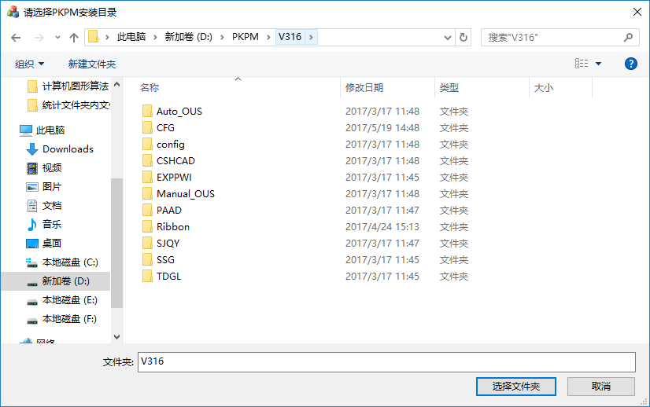

### 完整性检查的目的

在软件使用过程中，由于
- 杀毒软件误杀（真的是误杀，我们还没有技术能力写出病毒来）
- 用户误操作删除程序文件
- ...等等其他原因

导致程序运行时发生崩溃

通常这种原因问到我们这，我们也很崩溃，因为这种问题很难查啊~而经常查到问题的原因就是文件缺失或者和发行版本不匹配。因此，我们做了一个完整性检查的程序，来检查用户电脑上安装的PKPM版本的完整性。

### 完整性检查程序在哪？

PKPM安装目录\CFG\PKPMIntegrityCheck.exe

### 如何操作

1. 双击执行，选择对应版本

2. 点击“检查一致性”，选择该版本的安装目录，然后程序就自动开始检查。

### 完整性检查后弹出的文本是什么含义

### 软件原理

每个PKPM发行版在发布前，我们都会对安装文件计算一遍MD5值，并生成相关的配置文件放在光盘里。检查的时候同样遍历一遍安装目录下的各个文件，和配置文件中的MD5值进行比对。